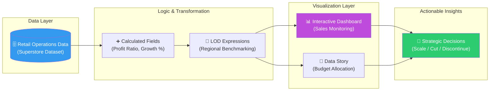
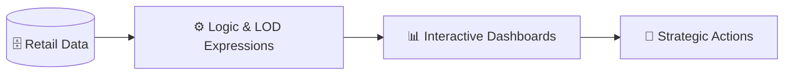

# 📊 RetailReveal: Executive Business Intelligence & Sales Data Storytelling

  
  
  
  
  

**RetailReveal** è una soluzione di Business Intelligence end-to-end progettata per modernizzare il reporting decisionale di un'organizzazione Retail paneuropea. Il progetto trasforma flussi di dati operativi frammentati in una piattaforma analitica interattiva su **Tableau**, abilitando la cultura del dato attraverso dashboard executive e "stories" prescrittive per l'allocazione del budget marketing basata sull'evidenza.

## 🏢 Valore Enterprise & Settori di Applicazione

| Settore / Ambito | Rilevanza & Benefici |
|-------------------|-----------|
| **Modern Retail & E-commerce** | Monitoraggio delle vendite in tempo reale, analisi della marginalità per prodotto e ottimizzazione della supply chain. |
| **Sales Operations (SalesOps)** | Identificazione di mercati geografici sotto-performanti e supporto alla forza vendita tramite self-service analytics. |
| **Marketing Intelligence** | Data-driven Budget Allocation: passaggio da decisioni intuitive a investimenti basati sul ROI e sulla crescita strutturale. |
| **Executive Reporting** | Consolidamento di report multipli in un'unica "Single Source of Truth" per stakeholder non tecnici e C-level. |

---

## 🎯 Executive Summary & Valore di Business
RetailReveal risolve il problema della "data fragmentation", offrendo una visione granulare e al tempo stesso olistica delle performance aziendali.

### 🏛️ 1. Architettura del Dashboard Executive
* **Self-Service Analytics:** Design incentrato sull'utente finale, con l'implementazione di filtri dinamici (regione, categoria, periodo) che permettono di passare da una visione globale a una navigazione drill-down in pochi clic.
* **Marginalità Granulare:** Utilizzo di tecniche avanzate di visualizzazione per evidenziare outlier di profitto, permettendo al management di identificare prodotti "loss-leader" o inefficienze logistiche.

### ⚙️ 2. Senior Tableau Engineering (LOD & Logic)
* **Level of Detail (LOD) Expressions:** Implementazione di calcoli `FIXED` e `INCLUDE` per gestire aggregazioni complesse indipendenti dai filtri di visualizzazione, garantendo coerenza nelle metriche di quota di mercato e benchmark.
* **Data Storytelling Prescrittivo:** Creazione di una **Tableau Story** che segue il framework *Context-Conflict-Conclusion*, guidando lo stakeholder verso la decisione finale (es. disinvestimento da linee di prodotto a basso margine).

### 🛡️ 3. Piattaforma Accessibile
* **Tableau Public Integration:** La soluzione è deployata su cloud, garantendo accessibilità cross-device e facilità di condivisione sicura dei risultati.

---

## 🏗️ Architettura del Ciclo BI

## 🛠️ Stack Tecnologico

| Layer | Tecnologia | Ruolo |
|:------|:-----------|:-----|
| 📊 **BI Tool** | Tableau Desktop | Dashboard Design & Modeling |
| ☁️ **Cloud** | Tableau Public | Deployment & Accessibility |
| 🔢 **Logic** | Calculated Fields | KPI Definition |
| 📐 **Advanced** | LOD Expressions | Complex Data Aggregations |
| 📖 **Storytelling** | Tableau Story Points | Narrative-Driven Analytics |

## 🚀 Esplora la Soluzione

L'intero progetto è navigabile online su Tableau Public:

  

*Progettato e sviluppato da Eugenio Pasqua.*

---

# 🇬🇧 ENGLISH VERSION

# 📊 RetailReveal: Executive Business Intelligence & Sales Data Storytelling

  
  

**RetailReveal** is an end-to-end Business Intelligence solution designed to modernize decision-making reporting for a pan-European retail organization. The project transforms fragmented operational data streams into an interactive analytical platform on **Tableau**, fostering a data-driven culture through executive dashboards and prescriptive "stories" for evidence-based marketing budget allocation.

## 🏢 Enterprise Value & Application Sectors

| Sector / Domain | Relevance & Benefits |
|-------------------|-----------|
| **Modern Retail** | Real-time sales monitoring, product margin analysis, and supply chain optimization. |
| **Sales Operations** | Identifying underperforming markets and supporting field teams via self-service analytics. |
| **Marketing Intelligence** | Data-driven Budget Allocation: shifting from intuition to ROI-based investment strategies. |

---

## 🏗️ BI Cycle Architecture

## 🧰 Technology Stack

`Tableau Desktop` · `Tableau Public` · `Calculated Fields` · `LOD Expressions` · `Story Points`

  

*Designed and developed by Eugenio Pasqua.*
